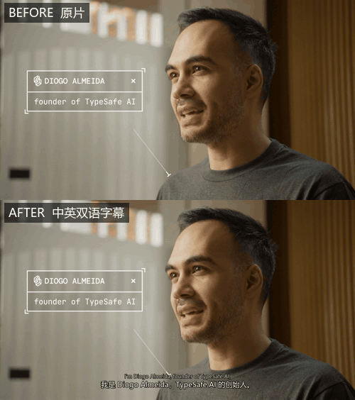

# video-subtitle-zh

给**没有字幕**的英文（及其他外语）视频配上中文字幕。

一条本地流水线：**抽音轨 → 语音识别 → 逐句翻译 → 生成字幕 → 压制成品**。

- 🖥 **识别在本地跑**，视频不上传、不联网
- 📝 输出**中英双语 / 纯中文**，SRT + ASS + 已烧字幕的成品视频
- 🌍 **跨平台**：Windows / macOS / Linux，字体自动探测
- 🤖 既可作为 **Agent Skill** 交给 AI 助手用，也能**纯命令行**跑
- 🎯 含**画面安全区探测**——抽帧分析画面占用，反推字幕该放多高

<p align="center">
  
</p>

<p align="center"><sub>
上：原片（画面自带动态排版）　·　下：加上中英双语字幕后<br>
完整 12 秒对比 → <a href="docs/demo-before-after.mp4">docs/demo-before-after.mp4</a>（1080p，含音轨）
</sub></p>

---

## 为什么不是又一个字幕工具

大部分"视频转字幕"工具把语音识别做完就结束了。但成品能不能用，差别在这三件事上，
而这个项目就是围绕它们设计的：

**1. 翻译交给 AI，而不是机器翻译 API。**
术语统一、语气对路、长短合适——这些机器翻译给不了。识别结果交给 AI 逐句翻，
专业名词先核实再落笔。这是成品和"能看"之间的分水岭。

**2. 字幕位置要量，不能猜。**
宣传片、发布会这类视频画面里本身就有大字，而且经常排得很低。
脚本抽帧算出**整幅画面的逐行占用率**，再在"字幕块高度"这个约束下找出最空闲的纵向区间，
反推字号、描边和边距——比拍脑袋写死一个 `marginV` 靠谱得多。

> 注意：得到的是**一个固定位置**。若素材的大字会扫过整幅画面，仍可能偶尔叠字，
> 见 [已知限制](#已知限制)。

**3. 压制参数要看素材定。**
4K 高细节素材用默认 CRF 会明显发糊（实测码率从 6.2Mbps 掉到 3.5Mbps，
网点纹理肉眼可见地糊了）。项目文档里写了判据和调法，不靠感觉。

---

## 快速开始

### 1. 装环境

```bash
# Windows
powershell -ExecutionPolicy Bypass -File install.ps1

# macOS / Linux
bash install.sh
```

脚本会建好隔离的虚拟环境、装依赖、检查 ffmpeg，最后打印一份环境自检。
**不会污染你的系统 Python**——删掉 `.venv` 就等于卸载干净。

> 需要 **Python 3.9+** 和 **ffmpeg**。ffmpeg 要自己装（各平台包管理器差异太大，
> 代装容易帮倒忙），脚本检测不到时会给出对应平台的安装命令。

### 2. 用

**方式 A：交给 AI 助手（推荐）**

这个仓库本身就是一个 [Agent Skill](https://www.workbuddy.cn/docs/workbuddy/Overview)——
把整个目录放到 `~/.workbuddy/skills/video-subtitle-zh/`，然后直接对 AI 说
"把这个英文视频配上中文字幕"。AI 会读 `SKILL.md`，按流程一路做完，
包括**逐句翻译**这个环节。

**方式 B：命令行**

```bash
<PY> scripts/01_transcribe.py "视频.mp4" --model small
#  → 产出 segments.json（识别结果）
#  翻译这一步：读 segments.json，写等长的 translations.json
<PY> scripts/02_make_srt.py <工作目录> --video "视频.mp4"
<PY> scripts/03_burn.py "视频.mp4" <工作目录>/bilingual.ass -o "输出.mp4" --crf 20
```

或者一把梭（识别完会停下来等你补译文，补好再跑一次接着做完）：

```bash
<PY> scripts/run_all.py "视频.mp4" --model distil-large-v3 --probe --crf 18
```

`<PY>` 指虚拟环境里的解释器：`.venv/bin/python`（macOS/Linux）
或 `.venv\Scripts\python.exe`（Windows）。

---

## 工作流里几个不那么显然的点

### 模型怎么选

| 模型 | 体积 | 什么时候用 |
|---|---|---|
| `small` | 480MB | 默认。清晰人声够用，跑得快 |
| `medium` | 1.5GB | 口音重、有背景音乐 |
| `large-v3` | 3.1GB | 多语言，最准 |
| `distil-large-v3` | 1.5GB | **英文内容首选**：准度接近 large-v3，快数倍 |

### 专有名词一定要给提示

这一步的收益最大。把产品名、人名、缩写写进 `--initial-prompt`，
模型会明显倾向于使用这些词：

```bash
--initial-prompt "TypeSafe, Jev, RLCD, Diogo Almeida"
```

即便如此**仍要通读一遍识别结果**。真实案例里遇到过的误听：
`Diogo`→`Diego`、`autoregression`→`audio regression`、`LLM`→`LM`（吞掉一个 L）。
错的专有名词会一路污染到译文，得先查证再改。

### 画面安全区

动态排版风格的视频，先量一下：

```bash
<PY> scripts/00_probe_safe_area.py "视频.mp4" --json
```

拿到 `suggested_margin_v` 传给字幕生成步骤。纯口播/采访类可以直接用默认值。

### 压制质量

| 素材 | 参数 |
|---|---|
| 普通口播/演示 | `--crf 20 --preset medium`（默认） |
| 4K 高细节、网点/渐变/细纹理 | `--crf 18 --preset slow` |
| 有 NVIDIA 显卡 | 加 `--encoder h264_nvenc` 提速数倍 |

判据：**比较输出码率和源文件**。明显偏低（比如源 6.2Mbps → 输出 3.5Mbps）
说明细节在丢，降 CRF 重压。

---

## 产物

| 文件 | 用途 |
|---|---|
| `bilingual.srt` | 中英双语，剪映 / B站 / 任意播放器直接加载 |
| `zh.srt` | 纯中文 |
| `bilingual.ass` / `zh.ass` | 带样式，可自己调字号位置后重新压制 |
| `*_cn.mp4` | 字幕已烧进画面，可直接分发 |

---

## 环境要求

- **Python 3.9+**
- **ffmpeg**（含 libass，用于字幕烧录；[gyan.dev](https://www.gyan.dev/ffmpeg/builds/)
  或各平台包管理器装的都带）
- 磁盘：`.venv` 约 400MB + 模型 480MB~3.1GB
- 中文字体：Windows 自带微软雅黑；macOS 自带苹方；Linux 需要
  `fonts-noto-cjk` 之类的包（脚本会检测并提示）

GPU 加速是可选的：有 NVIDIA 卡时会自动尝试，缺 CUDA 运行库会自动回落 CPU，
不会中断任务。

---

## 常见问题

装不上、识别跑不动、字幕显示成方块、压制太慢或发糊——见
[`references/troubleshooting.md`](references/troubleshooting.md)。

自检（排查任何问题都先跑这个）：

```bash
<PY> scripts/env.py
```

它会打印操作系统、依赖版本、ffmpeg 路径、探测到的中文字体及其字体名、
推理设备、已缓存模型——大部分问题看一眼就知道。

---

## 目录结构

```
video-subtitle-zh/
├── SKILL.md                      Agent Skill 入口（AI 读这个）
├── install.ps1 / install.sh      一键安装
├── requirements.txt
├── scripts/
│   ├── env.py                    跨平台环境探测（ffmpeg/字体/模型/设备）
│   ├── 00_probe_safe_area.py     画面底部安全区探测
│   ├── 01_transcribe.py          抽音轨 + 语音识别
│   ├── 02_make_srt.py            合成 SRT / ASS 字幕
│   ├── 03_burn.py                压制（硬字幕 / 软字幕）
│   ├── check_translations.py     译文校验（条数、空译、漏翻）
│   └── run_all.py                一键串联
├── references/
│   ├── translation-guide.md      字幕翻译规范
│   └── troubleshooting.md        排查手册
└── docs/
```

---

## 已知限制

**字幕位置是固定的，动态排版素材仍可能叠字。**
`00_probe_safe_area.py` 给出的是整片最优的**单一**位置。实测一条动态排版宣传片
（176 秒 / 52 句字幕）：字幕带落在 80%–94% 高度时占用率 25.7%，是画面里最空闲的区间，
但仍有约六成句子的字幕会与原片自带大字局部重叠，末段的密集排版段落尤其明显。

两条缓解路径：用 `--margin-v` 手工抬高；或只出纯中文单行字幕（占高更小，更容易塞进空隙）。

**浅色画面上的英文行对比度偏弱。**
双语样式里英文行用浅灰配细描边，落在白色/浅色背景上会发灰。中文行是白色加粗描边，
基本不受影响。素材若在明暗场景间频繁切换，建议只用 `zh.srt`，或自行调 `bilingual.ass`
里的 `BackColour` 给字幕加一层半透明底板。

---

## 许可

MIT

`docs/` 下的演示素材（`demo.gif`、`demo-before-after.mp4`、`preview.jpg`）截取自
**TypeSafe AI** 的产品发布视频，版权归 TypeSafe AI 所有，仅用于演示本工具的字幕效果，
**不在 MIT 许可覆盖范围内**。若要复用本仓库，请把 `docs/` 整体替换为你自己的素材。
